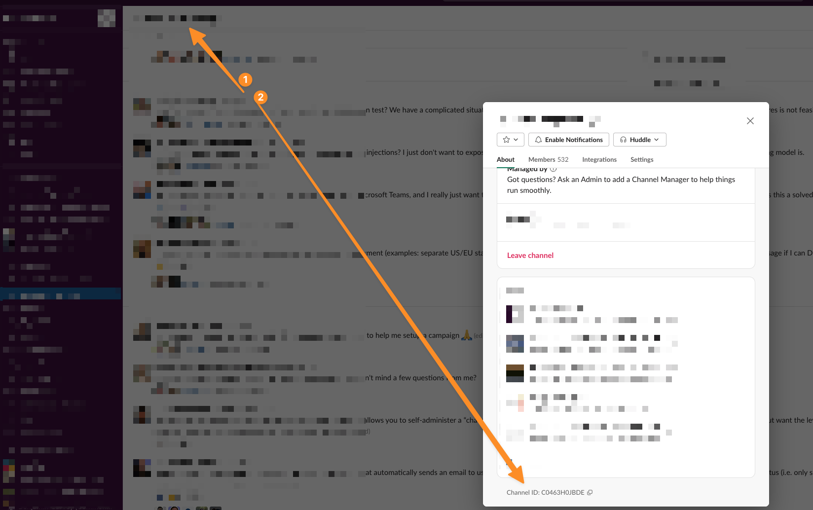
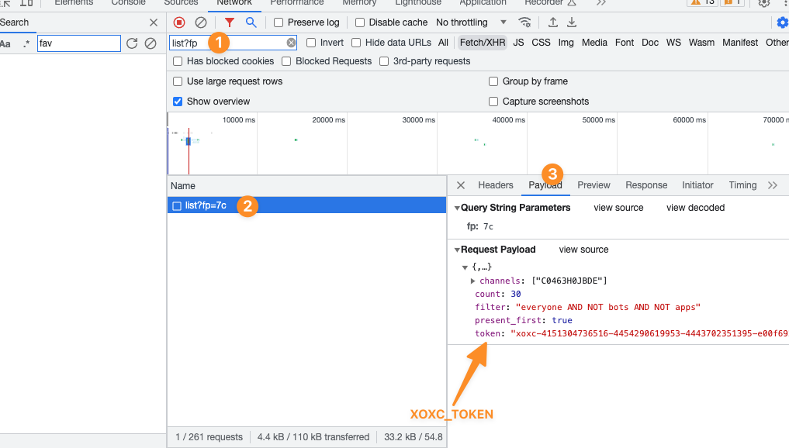
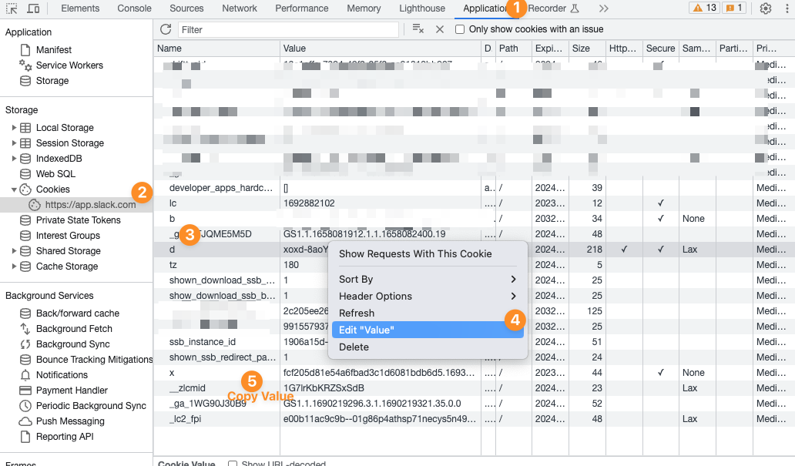

# Slackline
## _A tool used to send Slack DMs to a whole channel_

Slackline gives a member of a Slack community the power to
send a DM message to all members of a specific channel in that community.

> with great power comes great responsibility

## Features

- Get full list of users from a specific Slack channel in a Slack community
- Send customized (personal) message to every member of that Channel

## Usage

```bash
export XOXC_TOKEN=YOUR_XOXC_TOKEN
export D_TOKEN=YOUR_D_TOKEN
python slackline.py CHANNEL_ID MESSAGE
```

> **Note:** To send a **Customized Message** with users first name, include "[name]" in your message.

1. How to get CHANNEL_ID?
From the browser, go to https://SLACK_COMMUNITY.slack.com, click the relevant channel and follow the instructions:


2. How to get XOXC_TOKEN?
From the browser, go to https://SLACK_COMMUNITY.slack.com, open developer tools (F12 in most cases) and follow the instructions:


3. How to get D_TOKEN?
From the browser, go to https://SLACK_COMMUNITY.slack.com, open developer tools (F12 in most cases) and follow the instructions:

